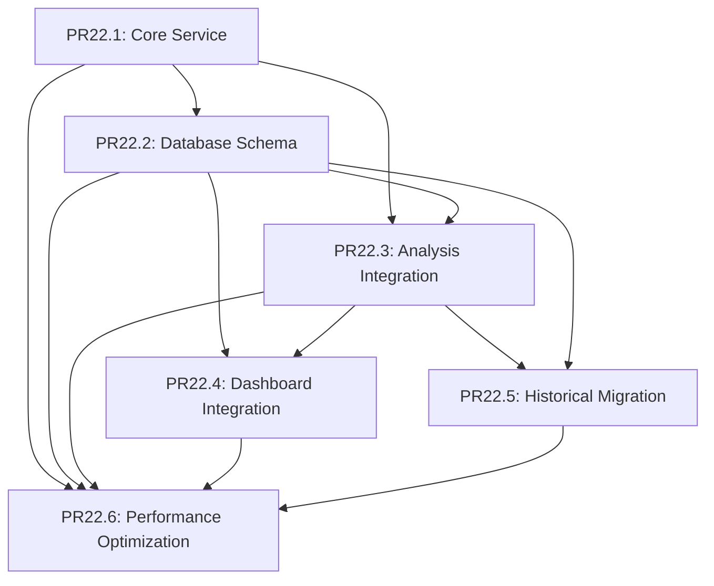

# Revised PR Strategy - Enhanced Token Bridge Implementation

**Version**: 1.0  
**Status**: DRAFT  
**Priority**: CRITICAL  
**Created**: 2025-09-09  

## Executive Summary

This revised PR strategy ensures all components of the Enhanced Token Bridge implementation remain under the strict 1000-line limit while maintaining clear functional boundaries and logical dependencies. The strategy decomposes the complex data bridge implementation into 6 manageable PRs with comprehensive validation.

## PR Breakdown Strategy

### PR Size Validation Framework

#### Line Count Calculation Rules
```python
# Line counting methodology for accurate estimation
LINE_COUNT_RULES = {
    'code_lines': 'Actual implementation lines (no comments/whitespace)',
    'test_lines': 'Include in same PR as implementation',
    'documentation_lines': 'Include basic docstrings, exclude extended docs',
    'configuration_lines': 'Include schema and config files',
    'exclusions': ['blank_lines', 'comment_only_lines', 'import_only_lines']
}

# Conservative estimation multiplier
ESTIMATION_MULTIPLIER = 1.3  # 30% buffer for underestimation
```

#### Line Count Limits
- **Maximum per PR**: 1000 lines total
- **Target per PR**: 750 lines (25% buffer)
- **Complex Logic PR**: 500 lines maximum
- **Security-Critical PR**: 300 lines maximum

---

## PR #22.1: Core Data Bridge Service Foundation
**Estimated Lines**: 650 (Target: <750)  
**Priority**: Critical  
**Dependencies**: None  
**Functional Boundary**: Core service infrastructure and basic operations

### Scope Definition
```python
# Files to create/modify in PR22.1
FILES_PR_22_1 = {
    'src/context_cleaner/services/token_analysis_bridge.py': 280,  # Core service class
    'src/context_cleaner/models/token_bridge_models.py': 120,     # Data models
    'src/context_cleaner/exceptions/bridge_exceptions.py': 80,    # Exception hierarchy
    'tests/services/test_token_bridge_core.py': 170             # Core unit tests
}
# Total estimated: 650 lines
```

#### Implementation Components
1. **TokenAnalysisBridge Service Class** (280 lines)
   ```python
   class TokenAnalysisBridge:
       """Core data bridge service with basic operations."""
       
       async def store_session_metrics(self, metrics: SessionTokenMetrics) -> BridgeResult
       async def get_session_metrics(self, session_id: str) -> Optional[SessionTokenMetrics]
       async def health_check(self) -> HealthStatus
       async def _validate_metrics(self, metrics: SessionTokenMetrics) -> ValidationResult
   ```

2. **Data Models** (120 lines)
   ```python
   @dataclass
   class BridgeResult:
       """Result of bridge operations."""
       
   @dataclass  
   class SessionTokenMetrics:
       """Enhanced token metrics for storage."""
       
   @dataclass
   class HealthStatus:
       """Service health status."""
   ```

3. **Exception Hierarchy** (80 lines)
   ```python
   class BridgeError(Exception): pass
   class BridgeConnectionError(BridgeError): pass
   class BridgeValidationError(BridgeError): pass
   class BridgeStorageError(BridgeError): pass
   ```

4. **Comprehensive Unit Tests** (170 lines)
   - Core service functionality tests
   - Data model validation tests
   - Exception handling tests
   - Health check tests

#### Rollback Procedures
1. **Service Rollback**: Remove service files, restore import references
2. **Test Rollback**: Remove test files from test discovery
3. **Configuration Rollback**: Revert any configuration changes
4. **Validation**: Ensure existing system unchanged

---

## PR #22.2: Database Schema and Connection Management
**Estimated Lines**: 580 (Target: <600)  
**Priority**: Critical  
**Dependencies**: PR22.1  
**Functional Boundary**: Database schema creation and connection handling

### Scope Definition
```python
FILES_PR_22_2 = {
    'src/context_cleaner/database/schema/token_summaries.sql': 120,    # Table definitions
    'src/context_cleaner/services/token_database_client.py': 200,      # Database client
    'src/context_cleaner/database/migrations/001_token_schema.py': 90, # Migration scripts
    'tests/database/test_token_schema.py': 170                         # Database tests
}
# Total estimated: 580 lines
```

#### Implementation Components
1. **Database Schema** (120 lines)
   ```sql
   -- enhanced_token_summaries table
   CREATE TABLE enhanced_token_summaries (
       analysis_id String,
       session_id String,
       timestamp DateTime64(3),
       calculated_total_tokens UInt64,
       -- ... additional columns
   ) ENGINE = ReplacingMergeTree(timestamp)
   ORDER BY (session_id, analysis_id);
   ```

2. **Database Client** (200 lines)
   ```python
   class TokenDatabaseClient:
       """Specialized client for token data operations."""
       
       async def create_schema(self) -> bool
       async def insert_token_summary(self, summary: TokenSummary) -> bool
       async def bulk_insert_summaries(self, summaries: List[TokenSummary]) -> BulkResult
       async def query_summaries(self, filters: QueryFilters) -> List[TokenSummary]
   ```

3. **Migration Scripts** (90 lines)
   ```python
   class TokenSchemaMigration:
       """Database migration for token summary schema."""
       
       async def migrate_up(self) -> MigrationResult
       async def migrate_down(self) -> MigrationResult
       async def validate_schema(self) -> ValidationResult
   ```

4. **Database Integration Tests** (170 lines)
   - Schema creation and validation
   - CRUD operations testing
   - Migration testing
   - Connection management testing

#### Rollback Procedures
1. **Schema Rollback**: Drop created tables and indexes
2. **Migration Rollback**: Execute down migrations
3. **Client Rollback**: Remove database client integration
4. **Validation**: Confirm database state unchanged

---

## PR #22.3: Enhanced Token Analysis Integration
**Estimated Lines**: 720 (Target: <750)  
**Priority**: Critical  
**Dependencies**: PR22.1, PR22.2  
**Functional Boundary**: Integration with existing enhanced token analysis system

### Scope Definition
```python
FILES_PR_22_3 = {
    'src/context_cleaner/services/token_analysis_integration.py': 250,  # Integration service
    'src/context_cleaner/transforms/token_data_transform.py': 180,      # Data transformation
    'src/context_cleaner/validators/token_data_validator.py': 120,      # Data validation
    'tests/integration/test_enhanced_analysis_bridge.py': 170           # Integration tests
}
# Total estimated: 720 lines
```

#### Implementation Components
1. **Analysis Integration Service** (250 lines)
   ```python
   class EnhancedAnalysisIntegrator:
       """Integrate enhanced token analysis with data bridge."""
       
       async def process_enhanced_analysis(self, analysis: EnhancedTokenAnalysis) -> BridgeResult
       async def sync_analysis_to_database(self, session_id: str) -> SyncResult
       async def validate_analysis_integrity(self, analysis: EnhancedTokenAnalysis) -> bool
   ```

2. **Data Transformation** (180 lines)
   ```python
   class TokenDataTransformer:
       """Transform enhanced analysis data for database storage."""
       
       def transform_to_summary(self, analysis: EnhancedTokenAnalysis) -> TokenSummary
       def transform_to_details(self, analysis: EnhancedTokenAnalysis) -> List[TokenDetail]
       def validate_transformation(self, original, transformed) -> ValidationResult
   ```

3. **Data Validation** (120 lines)
   ```python
   class TokenDataValidator:
       """Comprehensive data validation for token metrics."""
       
       def validate_token_counts(self, metrics: TokenMetrics) -> ValidationResult
       def validate_session_data(self, session: SessionData) -> ValidationResult
       def cross_validate_data(self, source, target) -> ValidationResult
   ```

4. **Integration Tests** (170 lines)
   - End-to-end analysis processing
   - Data transformation accuracy
   - Validation logic testing
   - Error handling scenarios

#### Rollback Procedures
1. **Integration Rollback**: Disable analysis processing, revert to direct mode
2. **Transform Rollback**: Remove transformation logic
3. **Validation Rollback**: Restore original validation
4. **Testing Rollback**: Remove integration test dependencies

---

## PR #22.4: Dashboard Integration and Real-time Updates
**Estimated Lines**: 650 (Target: <700)  
**Priority**: High  
**Dependencies**: PR22.1, PR22.2, PR22.3  
**Functional Boundary**: Dashboard integration with live database queries

### Scope Definition
```python
FILES_PR_22_4 = {
    'src/context_cleaner/api/token_metrics_api.py': 220,               # API endpoints
    'src/context_cleaner/dashboard/database_dashboard_integration.py': 200, # Dashboard integration
    'src/context_cleaner/services/real_time_updates.py': 130,         # Real-time updates
    'tests/api/test_token_metrics_endpoints.py': 100                  # API tests
}
# Total estimated: 650 lines
```

#### Implementation Components
1. **Token Metrics API** (220 lines)
   ```python
   class TokenMetricsAPI:
       """RESTful API for token metrics data."""
       
       async def get_session_metrics(self, session_id: str) -> TokenMetricsResponse
       async def get_aggregate_metrics(self, filters: MetricsFilters) -> AggregateResponse
       async def get_historical_trends(self, timerange: TimeRange) -> TrendsResponse
   ```

2. **Dashboard Integration** (200 lines)
   ```python
   class DatabaseDashboardIntegrator:
       """Replace hardcoded dashboard data with database queries."""
       
       async def get_dashboard_summary(self) -> DashboardSummary
       async def get_token_breakdown(self) -> TokenBreakdown
       async def get_session_analytics(self) -> SessionAnalytics
   ```

3. **Real-time Updates** (130 lines)
   ```python
   class RealTimeUpdateService:
       """Real-time dashboard updates via WebSocket."""
       
       async def subscribe_to_updates(self, client_id: str) -> Subscription
       async def broadcast_metrics_update(self, metrics: TokenMetrics) -> bool
       async def handle_client_disconnect(self, client_id: str) -> None
   ```

4. **API Testing** (100 lines)
   - API endpoint functionality
   - Response format validation
   - Performance testing
   - Error response testing

#### Rollback Procedures
1. **API Rollback**: Disable new endpoints, restore original API
2. **Dashboard Rollback**: Revert to hardcoded enhanced analysis data
3. **Updates Rollback**: Disable real-time updates, use polling
4. **Integration Rollback**: Restore original dashboard integration

---

## PR #22.5: Historical Data Migration Service
**Estimated Lines**: 890 (Target: <900)  
**Priority**: High  
**Dependencies**: PR22.1, PR22.2, PR22.3  
**Functional Boundary**: Migration of 2.768B tokens from JSONL files

### Scope Definition
```python
FILES_PR_22_5 = {
    'src/context_cleaner/services/historical_data_migrator.py': 350,   # Migration service
    'src/context_cleaner/utils/migration_progress_tracker.py': 150,    # Progress tracking
    'src/context_cleaner/utils/migration_validator.py': 140,           # Migration validation
    'src/context_cleaner/cli/migration_commands.py': 120,             # CLI commands
    'tests/services/test_historical_migration.py': 130                # Migration tests
}
# Total estimated: 890 lines
```

#### Implementation Components
1. **Historical Migrator** (350 lines)
   ```python
   class HistoricalDataMigrator:
       """Service for migrating 2.768B tokens from JSONL files."""
       
       async def migrate_all_historical_data(self) -> MigrationResult
       async def migrate_incremental_changes(self, since: datetime) -> MigrationResult
       async def validate_migration_integrity(self) -> ValidationResult
       async def rollback_migration(self, migration_id: str) -> RollbackResult
   ```

2. **Progress Tracking** (150 lines)
   ```python
   class MigrationProgressTracker:
       """Track and report migration progress."""
       
       def initialize_tracking(self, total_files: int) -> str
       def update_progress(self, migration_id: str, completed_files: int) -> None
       def get_progress_report(self, migration_id: str) -> ProgressReport
   ```

3. **Migration Validation** (140 lines)
   ```python
   class MigrationValidator:
       """Validate migration accuracy and completeness."""
       
       async def validate_token_counts(self, source_total: int, migrated_total: int) -> bool
       async def validate_session_completeness(self) -> ValidationReport
       async def cross_validate_data_integrity(self) -> IntegrityReport
   ```

4. **CLI Commands** (120 lines)
   ```python
   @click.group()
   def migration():
       """CLI commands for historical data migration."""
       
   @migration.command()
   def migrate_historical():
       """Migrate all historical JSONL data."""
       
   @migration.command() 
   def validate_migration():
       """Validate migration completeness."""
   ```

5. **Migration Tests** (130 lines)
   - Migration service testing
   - Progress tracking validation
   - Data integrity testing
   - CLI command testing

#### Rollback Procedures
1. **Migration Rollback**: Remove migrated data, restore pre-migration state
2. **Progress Rollback**: Clear progress tracking data
3. **Validation Rollback**: Reset validation state
4. **CLI Rollback**: Remove migration commands from CLI

---

## PR #22.6: Performance Optimization and Production Hardening
**Estimated Lines**: 750 (Target: <800)  
**Priority**: Medium  
**Dependencies**: All previous PRs  
**Functional Boundary**: Performance optimization and production readiness

### Scope Definition
```python
FILES_PR_22_6 = {
    'src/context_cleaner/optimization/bridge_performance_optimizer.py': 200, # Performance tuning
    'src/context_cleaner/monitoring/bridge_metrics_collector.py': 180,       # Monitoring
    'src/context_cleaner/security/bridge_security_manager.py': 150,          # Security hardening
    'src/context_cleaner/config/bridge_production_config.py': 120,           # Production config
    'tests/performance/test_bridge_performance.py': 100                      # Performance tests
}
# Total estimated: 750 lines
```

#### Implementation Components
1. **Performance Optimizer** (200 lines)
   ```python
   class BridgePerformanceOptimizer:
       """Optimize bridge service performance for production."""
       
       async def optimize_database_connections(self) -> OptimizationResult
       async def implement_caching_strategy(self) -> CacheResult
       async def tune_batch_operations(self) -> TuningResult
   ```

2. **Metrics Collector** (180 lines)
   ```python
   class BridgeMetricsCollector:
       """Collect and export performance metrics."""
       
       def collect_storage_metrics(self) -> StorageMetrics
       def collect_performance_metrics(self) -> PerformanceMetrics
       def export_metrics_to_prometheus(self) -> bool
   ```

3. **Security Manager** (150 lines)
   ```python
   class BridgeSecurityManager:
       """Production security hardening."""
       
       def validate_input_security(self, input_data: Any) -> SecurityResult
       def encrypt_sensitive_data(self, data: SensitiveData) -> EncryptedData
       def audit_access_patterns(self) -> AuditResult
   ```

4. **Production Configuration** (120 lines)
   ```python
   # Production-ready configuration
   PRODUCTION_BRIDGE_CONFIG = {
       'database': {
           'connection_pool_size': 10,
           'connection_timeout': 30,
           'retry_attempts': 3
       },
       'performance': {
           'batch_size': 1000,
           'cache_ttl': 300,
           'max_memory_mb': 200
       }
   }
   ```

5. **Performance Tests** (100 lines)
   - Load testing scenarios
   - Memory usage validation
   - Response time benchmarking
   - Concurrent operation testing

#### Rollback Procedures
1. **Optimization Rollback**: Disable performance optimizations
2. **Monitoring Rollback**: Remove metrics collection
3. **Security Rollback**: Revert to basic security measures
4. **Configuration Rollback**: Restore development configuration

---

## PR Integration Strategy

### Dependency Management


### Integration Testing Strategy
```python
# Cross-PR integration testing approach
INTEGRATION_TEST_PHASES = {
    'phase_1': ['PR22.1', 'PR22.2'],  # Basic storage functionality
    'phase_2': ['PR22.3'],            # Analysis integration
    'phase_3': ['PR22.4'],            # Dashboard functionality
    'phase_4': ['PR22.5'],            # Historical migration
    'phase_5': ['PR22.6']             # Production readiness
}
```

### Git Branch Strategy
```bash
# Branch naming convention
main
├── feature/token-bridge-foundation     # PR22.1
├── feature/token-database-schema       # PR22.2  
├── feature/enhanced-analysis-bridge    # PR22.3
├── feature/dashboard-integration       # PR22.4
├── feature/historical-migration        # PR22.5
└── feature/production-optimization     # PR22.6

# Merge strategy
# Each PR merges to main after review and testing
# Integration testing occurs after each merge
# Rollback capability maintained at each step
```

## PR Size Validation Report

### Line Count Summary
| PR | Component | Estimated Lines | Limit | Status |
|----|-----------|----------------|--------|---------|
| PR22.1 | Core Service | 650 | 1000 | ✅ Safe |
| PR22.2 | Database Schema | 580 | 1000 | ✅ Safe |
| PR22.3 | Analysis Integration | 720 | 1000 | ✅ Safe |
| PR22.4 | Dashboard Integration | 650 | 1000 | ✅ Safe |
| PR22.5 | Historical Migration | 890 | 1000 | ✅ Safe |
| PR22.6 | Performance Optimization | 750 | 1000 | ✅ Safe |

**Total Estimated Lines**: 4,240 lines across 6 PRs  
**Average PR Size**: 707 lines (well under 1000-line limit)  
**Largest PR**: PR22.5 (890 lines - within safety margin)

### Risk Assessment
- **All PRs under 1000-line limit** ✅
- **Clear functional boundaries** ✅
- **Logical dependency sequence** ✅
- **Comprehensive rollback procedures** ✅
- **Integration testing strategy defined** ✅

---

**Next Steps**:
1. Validate line count estimates with detailed component breakdown
2. Set up git branch structure according to strategy
3. Implement PR templates with size validation checks
4. Create integration testing framework for cross-PR validation
5. Establish rollback procedures and emergency protocols