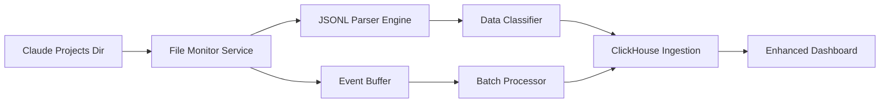

# JSONL to ClickHouse Real-Time Stream Processing - Implementation Plan

## Executive Summary

This plan outlines implementing a real-time monitoring system to stream Claude Code JSONL session data to ClickHouse, providing enhanced metrics beyond the current OTEL telemetry limitations.

**Current Problem**: OTEL telemetry only shows `<REDACTED>` for user prompts, missing 144.79 MB of actual context data stored in local JSONL files.

**Solution**: Real-time JSONL file monitoring → Parse & classify data → Stream to ClickHouse → Enhanced dashboard metrics

## 1. System Architecture

### 1.1 Core Components



**Components:**
1. **File Monitor Service**: Watch `~/.claude/projects/*/*.jsonl` for changes
2. **JSONL Parser Engine**: Parse new JSONL entries in real-time
3. **Data Classifier**: Categorize entries by type (user/assistant/tool_use/tool_result)
4. **Event Buffer**: Queue system for handling bursts
5. **Batch Processor**: Group events for efficient ClickHouse insertion
6. **Enhanced Dashboard**: New metrics endpoints using enriched data

### 1.2 Data Flow

```
File Change → Parse Line → Classify → Buffer → Batch → ClickHouse → Dashboard
     ↓           ↓          ↓        ↓      ↓        ↓          ↓
  inotify    JSON parse   Type ID   Queue   5s     INSERT    API query
```

## 2. Database Schema Design

### 2.1 Proposed ClickHouse Tables

Based on JSONL structure analysis, we need these tables:

#### 2.1.1 `claude_sessions` (Session Metadata)
```sql
CREATE TABLE otel.claude_sessions (
    session_id String,
    project_directory String,
    user_type LowCardinality(String),
    version LowCardinality(String),
    git_branch String,
    start_time DateTime64(3),
    last_activity DateTime64(3),
    total_entries UInt32,
    total_size_bytes UInt64
) ENGINE = ReplacingMergeTree()
ORDER BY (session_id, project_directory)
PARTITION BY toDate(start_time);
```

#### 2.1.2 `claude_messages` (All Conversation Messages)
```sql
CREATE TABLE otel.claude_messages (
    uuid String,
    session_id String,
    parent_uuid String,
    timestamp DateTime64(3),
    type LowCardinality(String), -- 'user', 'assistant', 'summary'
    role LowCardinality(String), -- 'user', 'assistant'
    model LowCardinality(String),
    content_type LowCardinality(String), -- 'text', 'tool_use', 'tool_result'
    content_length UInt32,
    content_preview String, -- First 500 chars
    content_hash String, -- SHA-256 for dedup
    is_sidechain Bool,
    cwd String,
    git_branch String,
    
    -- Usage metrics (for assistant messages)
    input_tokens UInt32,
    output_tokens UInt32,
    cache_creation_input_tokens UInt32,
    cache_read_input_tokens UInt32,
    cost_estimate Float64,
    
    -- Content analysis
    contains_code Bool,
    contains_file_paths Bool,
    contains_sensitive_data Bool,
    language_detected LowCardinality(String)
) ENGINE = MergeTree()
ORDER BY (session_id, timestamp)
PARTITION BY toDate(timestamp);
```

#### 2.1.3 `claude_tool_usage` (Tool Operations)
```sql
CREATE TABLE otel.claude_tool_usage (
    tool_use_id String,
    session_id String,
    message_uuid String,
    timestamp DateTime64(3),
    tool_name LowCardinality(String), -- Read, Write, Bash, etc.
    operation_type LowCardinality(String), -- 'use', 'result'
    
    -- Tool parameters (JSON extraction)
    file_path String,
    command String,
    query String,
    target_directory String,
    
    -- Tool results
    success Bool,
    error_message String,
    result_size_bytes UInt32,
    result_type LowCardinality(String), -- 'file_content', 'command_output', 'error'
    execution_time_ms UInt32,
    
    -- Security analysis
    accesses_sensitive_files Bool,
    modifies_system_files Bool,
    network_access Bool
) ENGINE = MergeTree()
ORDER BY (session_id, timestamp, tool_name)
PARTITION BY toDate(timestamp);
```

#### 2.1.4 `claude_file_access` (File Operations Tracking)
```sql
CREATE TABLE otel.claude_file_access (
    session_id String,
    timestamp DateTime64(3),
    file_path String,
    operation LowCardinality(String), -- 'read', 'write', 'edit'
    file_size_bytes UInt32,
    file_extension LowCardinality(String),
    is_sensitive_file Bool,
    content_type LowCardinality(String), -- 'code', 'config', 'data', 'text'
    access_pattern LowCardinality(String), -- 'first_time', 'repeated', 'batch'
) ENGINE = MergeTree()
ORDER BY (file_path, session_id, timestamp)
PARTITION BY toDate(timestamp);
```

#### 2.1.5 `claude_context_analysis` (Context Window Analysis)
```sql
CREATE TABLE otel.claude_context_analysis (
    session_id String,
    timestamp DateTime64(3),
    context_size_bytes UInt64,
    estimated_tokens UInt32,
    file_count UInt16,
    tool_call_count UInt16,
    unique_files_accessed UInt16,
    context_efficiency_score Float32,
    redundancy_percentage Float32
) ENGINE = ReplacingMergeTree()
ORDER BY (session_id, timestamp)
PARTITION BY toDate(timestamp);
```

### 2.2 Materialized Views for Analytics

```sql
-- Daily session summary
CREATE MATERIALIZED VIEW otel.daily_session_summary_mv TO otel.daily_session_summary AS
SELECT
    toDate(timestamp) as date,
    session_id,
    project_directory,
    count() as message_count,
    sum(input_tokens) as total_input_tokens,
    sum(output_tokens) as total_output_tokens,
    sum(cost_estimate) as total_cost,
    countIf(type = 'tool_use') as tool_usage_count,
    uniq(file_path) as unique_files_accessed
FROM otel.claude_messages
WHERE timestamp >= yesterday()
GROUP BY date, session_id, project_directory;
```

## 3. Implementation Operations

### 3.1 Phase 1: File Monitoring Service

**Technology Stack:**
- **Python**: `watchdog` library for cross-platform file monitoring
- **asyncio**: For non-blocking file operations
- **aiofiles**: Async file reading
- **asyncio.Queue**: Event buffering

**Operations:**
1. **Directory Discovery**: Scan `~/.claude/projects/*` for existing JSONL files
2. **File Watcher Setup**: Monitor all JSONL files for modifications
3. **Change Detection**: Detect new lines appended to files
4. **Offset Tracking**: Track read position per file to avoid re-processing
5. **Error Recovery**: Handle file rotation, deletion, permission changes

**Code Structure:**
```python
class JsonlFileMonitor:
    def __init__(self, projects_dir: str, event_queue: asyncio.Queue):
        self.projects_dir = projects_dir
        self.event_queue = event_queue
        self.file_offsets = {}  # Track read positions
        self.observer = Observer()
    
    async def start_monitoring(self):
        # Setup file watchers for all JSONL files
        # Handle file modifications, creations, deletions
        pass
    
    async def process_file_change(self, file_path: str):
        # Read new lines from offset
        # Parse JSONL entries
        # Queue for processing
        pass
```

### 3.2 Phase 2: JSONL Parser & Classifier Engine

**Operations:**
1. **Line-by-Line Parsing**: Stream process new JSONL entries
2. **JSON Validation**: Validate structure and handle malformed entries
3. **Type Classification**: Identify message types (user/assistant/tool_use/tool_result)
4. **Content Extraction**: Extract key fields based on entry type
5. **Data Enrichment**: Add metadata (file sizes, content analysis, timestamps)

**Classification Logic:**
```python
def classify_jsonl_entry(entry: dict) -> EntryType:
    if entry.get('type') == 'summary':
        return EntryType.SUMMARY
    elif entry.get('type') == 'user':
        return EntryType.USER_MESSAGE  
    elif entry.get('type') == 'assistant':
        content = entry.get('message', {}).get('content', [])
        if any(item.get('type') == 'tool_use' for item in content):
            return EntryType.ASSISTANT_TOOL_USE
        else:
            return EntryType.ASSISTANT_MESSAGE
    elif 'toolUseResult' in entry:
        return EntryType.TOOL_RESULT
    else:
        return EntryType.UNKNOWN
```

### 3.3 Phase 3: ClickHouse Ingestion Pipeline

**Operations:**
1. **Batch Collection**: Group events into batches (100-500 records)
2. **Data Transformation**: Convert to ClickHouse-compatible format
3. **Bulk Insert**: Use ClickHouse batch insertion for efficiency
4. **Error Handling**: Retry failed insertions, dead letter queue
5. **Monitoring**: Track ingestion rates, failures, lag

**Batch Processing:**
```python
class ClickHouseIngestionPipeline:
    def __init__(self, clickhouse_client, batch_size=200):
        self.client = clickhouse_client
        self.batch_size = batch_size
        self.pending_batches = {
            'messages': [],
            'tool_usage': [],
            'file_access': [],
            'context_analysis': []
        }
    
    async def process_batch(self, entries: List[dict]):
        # Transform entries to table-specific records
        # Execute batch INSERT statements
        # Handle errors and retries
        pass
```

### 3.4 Phase 4: Dashboard Integration

**New API Endpoints:**
1. `/api/claude-sessions` - Session overview with real context data
2. `/api/claude-tool-usage` - Tool usage patterns and efficiency
3. `/api/claude-file-access` - File access heatmaps and patterns
4. `/api/claude-context-trends` - Context window usage over time
5. `/api/claude-cost-analysis` - Enhanced cost tracking with real data

## 4. Access Patterns & Dashboard Enhancements

### 4.1 Enhanced Metrics

**Current vs Enhanced:**

| Current (OTEL) | Enhanced (JSONL Stream) |
|----------------|-------------------------|
| `<REDACTED>` prompts | Full conversation analysis |
| Tool names only | Complete tool parameters & results |
| Basic token counts | Context window efficiency metrics |
| API-level costs | Session-level cost attribution |
| No file tracking | File access patterns & sizes |

### 4.2 New Dashboard Sections

#### 4.2.1 **Enhanced Context Intelligence**
- **Real Context Usage**: Show actual vs estimated token usage
- **Context Efficiency Score**: How much of context window is useful
- **File Access Heatmap**: Most frequently accessed files per session
- **Redundancy Analysis**: Duplicate content detection

#### 4.2.2 **Tool Usage Intelligence** 
- **Tool Efficiency Metrics**: Success rates, execution times
- **File Operation Patterns**: Read/write/edit frequencies
- **Command Analysis**: Most used bash commands, patterns
- **Error Pattern Detection**: Common tool failure modes

#### 4.2.3 **Cost Intelligence**
- **Session-Level Attribution**: Cost per project directory
- **Context vs Output Ratio**: Cost efficiency of long contexts
- **Tool Cost Analysis**: Most expensive operations
- **Budget Tracking**: Real-time burn rate per project

#### 4.2.4 **Security Intelligence**
- **Sensitive File Access**: Tracking config, key, credential files
- **Command Safety Analysis**: Potentially dangerous operations
- **Data Exposure Tracking**: What content is being sent to Claude

### 4.3 Query Patterns

**High-Frequency Queries** (< 100ms):
- Current active sessions count
- Today's token usage by directory
- Recent tool usage patterns
- Real-time context window status

**Medium-Frequency Queries** (100ms-1s):
- Weekly cost trends by project
- File access frequency analysis
- Tool success rate analytics
- Context efficiency trends

**Low-Frequency Queries** (1s+):
- Historical conversation analysis
- Deep context pattern recognition
- Cross-session file usage correlation
- Advanced security auditing

## 5. Potential Pitfalls & Mitigation Strategies

### 5.1 Performance Pitfalls

**1. File I/O Bottlenecks**
- *Risk*: Large JSONL files (50MB+) causing memory issues
- *Mitigation*: Stream processing, read only new lines, async I/O
- *Monitoring*: Track file sizes, read performance, memory usage

**2. ClickHouse Insert Performance**
- *Risk*: High-frequency small inserts causing performance degradation
- *Mitigation*: Batch processing (200+ records), async inserts, partitioning
- *Monitoring*: Insert rates, query performance, storage growth

**3. Event Processing Lag**
- *Risk*: Processing falling behind real-time file changes
- *Mitigation*: Queue monitoring, backpressure handling, scaling workers
- *Monitoring*: Queue depth, processing latency, error rates

### 5.2 Data Consistency Pitfalls

**1. File Rotation/Truncation**
- *Risk*: JSONL files being rotated or truncated during processing
- *Mitigation*: File handle management, offset validation, retry logic
- *Monitoring*: File integrity checks, missing entries detection

**2. Duplicate Processing**
- *Risk*: Same JSONL entries processed multiple times
- *Mitigation*: Offset tracking, UUID-based deduplication, idempotent inserts
- *Monitoring*: Duplicate detection metrics, data consistency checks

**3. Schema Evolution**
- *Risk*: Claude Code changes JSONL format, breaking parsers
- *Mitigation*: Flexible schema design, version detection, fallback parsing
- *Monitoring*: Parse failure rates, schema version distribution

### 5.3 Privacy & Security Pitfalls

**1. Sensitive Data Exposure**
- *Risk*: Accidentally storing credentials, API keys in ClickHouse
- *Mitigation*: Content filtering, PII detection, data sanitization
- *Monitoring*: Sensitive pattern detection alerts

**2. Storage Compliance**
- *Risk*: Storing user data without proper consent/retention policies
- *Mitigation*: Configurable data retention, anonymization options
- *Monitoring*: Data volume alerts, retention policy compliance

**3. Access Control**
- *Risk*: Unauthorized access to conversation data
- *Mitigation*: ClickHouse user permissions, API authentication
- *Monitoring*: Access logs, permission auditing

### 5.4 Operational Pitfalls

**1. Resource Consumption**
- *Risk*: Monitoring service consuming excessive CPU/memory
- *Mitigation*: Resource limits, efficient algorithms, monitoring
- *Monitoring*: Resource usage alerts, performance benchmarks

**2. Service Reliability**
- *Risk*: Monitoring service crashes causing data loss
- *Mitigation*: Service restart logic, state persistence, health checks
- *Monitoring*: Service uptime, crash detection, recovery time

**3. Storage Growth**
- *Risk*: Unbounded ClickHouse storage growth
- *Mitigation*: Automated TTL policies, compression, archiving
- *Monitoring*: Storage usage trends, growth rate alerts

## 6. Implementation Timeline & Milestones

### Phase 1: Foundation (Week 1-2)
- [ ] File monitoring service implementation
- [ ] Basic JSONL parsing engine
- [ ] ClickHouse table creation
- [ ] Unit tests for core components

### Phase 2: Core Pipeline (Week 2-3)
- [ ] Event classification system
- [ ] Batch processing pipeline
- [ ] ClickHouse ingestion logic
- [ ] Error handling and retries

### Phase 3: Dashboard Integration (Week 3-4)
- [ ] New API endpoints
- [ ] Enhanced metrics calculations
- [ ] Dashboard UI updates
- [ ] Performance optimization

### Phase 4: Production Readiness (Week 4-5)
- [ ] Monitoring and alerting
- [ ] Security and privacy features
- [ ] Documentation and deployment
- [ ] Load testing and optimization

## 7. Success Metrics

**Technical Metrics:**
- Processing latency < 500ms for 95% of events
- Zero data loss during normal operations
- ClickHouse query performance < 100ms for dashboard queries
- Service uptime > 99.5%

**Business Metrics:**
- Enhanced context intelligence providing actionable insights
- Cost attribution accuracy improvement > 90%
- Tool usage optimization recommendations
- File access pattern insights

## 8. Resource Requirements

**Development:**
- 2-3 weeks senior developer time
- Infrastructure: Existing ClickHouse instance
- Testing: Local development environment

**Production:**
- CPU: 2-4 cores for monitoring service
- Memory: 2-4GB for event processing
- Storage: ~100MB/day additional ClickHouse storage
- Network: Minimal (local file access only)

## 9. Risk Assessment

**High Impact, Low Probability:**
- Claude Code JSONL format major breaking change
- ClickHouse instance failure

**Medium Impact, Medium Probability:**
- Performance degradation under high load
- Data processing lag during bursts

**Low Impact, High Probability:**
- Individual file parsing errors
- Temporary service restarts

## Conclusion

This implementation will transform our dashboard from showing incomplete OTEL metrics to providing comprehensive, real-time insights into actual Claude Code usage patterns. The enhanced data will enable better cost optimization, security monitoring, and context intelligence than currently possible.

The modular architecture ensures we can iterate quickly and adapt to changes in Claude Code's data format while maintaining high performance and reliability.

**Immediate Next Steps:**
1. Create proof-of-concept file monitor
2. Design initial ClickHouse schema
3. Test with sample JSONL data
4. Validate performance assumptions
